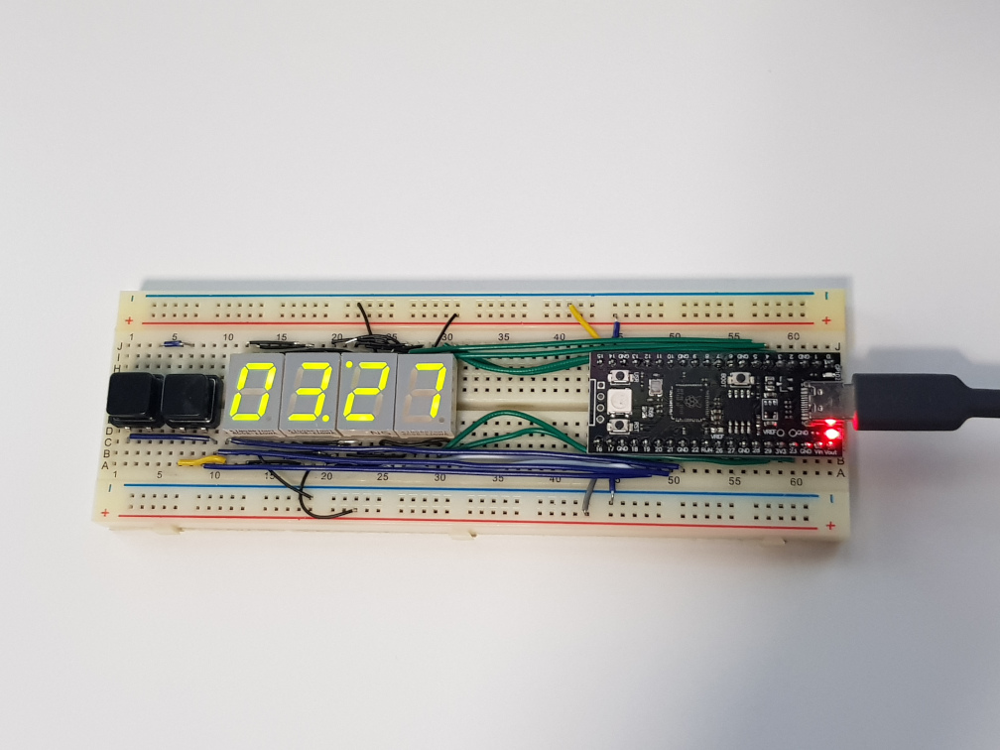
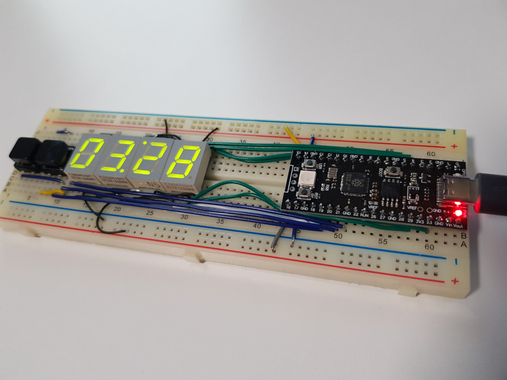

# PiCloc

Simple Raspberry Pi Pico clock. Uses onboard RTC for keeping time.

Schematic available [in images folder](./images/schematic.pdf).

Compilation flags should be set before building the firmware in [settings.h](./settings.h).  
To build the project, use the included [build.sh script](./build.sh) (pico-sdk needs to be installed before).

## TODO

- design 3d-printed case
- V2: use Pi Pico W and get time from NTP serwer
